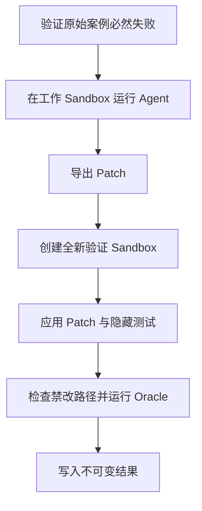

# 第 13 章 · 评测体系

一次演示成功不能证明 Agent 可靠。评测必须把“Agent 自己说成功”和“独立验证确实修复”分开。

## 快速开始

[打开通用 Codespaces](https://codespaces.new/nickdu2009/repofix-agent-book?quickstart=1&devcontainer_path=examples%2Frepofix%2F.devcontainer%2Fdevcontainer.json){ .md-button .md-button--primary }

| 用途 | 路径 |
| --- | --- |
| 只读 Eval Runner 骨架 | `examples/repofix/labs/chapter-13/start/` |
| 你的练习副本 | `examples/repofix/.work/chapter-13/` |
| 参考实现 | `examples/repofix/labs/chapter-13/solution/` |

```bash
cd examples/repofix
make chapter-prepare CHAPTER=chapter-13
python .work/chapter-13/exercise.py
make chapter-check CHAPTER=chapter-13
```

在 `.work/chapter-13/exercise.py` 中实现通过率聚合，并覆盖空样本失败，再对照 solution；start 保持只读。`chapter-check` 只检查练习结构与 TODO，Python 输出才是行为证据。独立 Oracle 与作弊失败路径在本章后续通过主项目 `evals/` 实现和测试。

## 本章契约

- **前置**：Fake Agent Loop、Daytona Adapter 和第一个 fixture 已完成。
- **产物**：EvalCase Loader、Runner、独立 Oracle、JSONL 报告和首批 3～5 个案例。
- **费用**：单元测试与契约测试不使用真实模型；Smoke Eval 必须显式启动。
- **验收**：Agent 即使修改或删除公开测试，也不能骗过最终判定。

!!! info "集成参考的当前范围"
    伴随代码已经提供一个零云端、作者可信的 `python-floor-division` 案例，用两个临时目录演示候选工作区与独立 Oracle，并测试“改公开测试”和“针对公开样例过拟合”。它不是安全沙箱；接真实模型时必须把两个目录替换为独立 Daytona Sandbox。

## 案例结构

```text
evals/cases/python-floor-division/
├── repository/             # Agent 可见的起始仓库
├── issue.md                # Agent 可见的任务
├── hidden-tests/           # Agent 不可见
└── metadata.json
```

```json
{
  "case_id": "python-floor-division",
  "language": "python",
  "test_target": "unit",
  "timeout_seconds": 30,
  "forbidden_paths": ["tests/**", ".github/**"]
}
```

命令使用可信 `command_id`，不从 metadata 直接执行任意 shell 字符串。

## 可信验证流程



必须使用第二个干净 Sandbox 做最终验证。否则 Agent 可以修改测试、污染工作目录或利用残留依赖制造假成功。

## 领域模型

```python
@dataclass(frozen=True)
class EvalResult:
    case_id: str
    outcome: Literal[
        "passed", "agent_failed", "oracle_failed", "timed_out", "infrastructure_failed"
    ]
    steps: int
    duration_ms: int
    input_tokens: int
    output_tokens: int
    model: str
    prompt_version: str
    source_commit: str
    patch_sha256: str | None
```

基础设施失败必须与 Agent 失败分开统计，但两者都要出现在报告中，不能静默重试到成功。

## Runner 步骤

当前 `evals/runner.py` 已用 Fake Repairer 实现步骤 1、2、4、5、6、7；接入 Live Agent 后继续补齐模型轨迹和云端 Artifact。完整 `run_eval(case)` 应明确实现：

1. 校验 metadata Schema 和固定 commit。
2. 在干净 Sandbox 证明基线测试失败。
3. 启动 Agent，并记录模型、Prompt、工具和依赖版本。
4. 导出 patch，拒绝禁改路径和超大 Diff。
5. 在新的 Sandbox 应用 patch 和隐藏测试。
6. 执行可信 Oracle。
7. 无论结果如何，清理两个 Sandbox。
8. 追加写入 JSONL，并生成聚合报告。

## 指标定义

| 指标 | 明确定义 |
| --- | --- |
| 任务成功率 | `passed / 全部有效案例运行` |
| Agent 声称成功率 | Agent 调用 `finish` 的比例，仅作诊断 |
| 测试通过率 | 独立 Oracle 通过的测试数/测试总数 |
| 超时率 | `timed_out / 全部有效案例运行` |
| 无效工具率 | Schema、未知工具或权限拒绝次数/全部工具调用 |
| 成本 | 使用执行时保存的模型价格版本计算，报告中保留原始 Token |

每个案例至少重复 3 次后再比较 Prompt；同时报告均值、中位数和成功次数，不用单次结果下结论。

## 测试与命令

```bash
make eval-unit
make eval-fixtures
RUN_LIVE_EVAL=1 make eval-smoke
```

- `eval-unit`：运行确定性 Runner/Oracle 测试，始终在 CI 运行；不要把测试数量写成稳定接口。
- `eval-fixtures`：当前验证案例初始失败和隐藏 Oracle；扩充案例时继续加入 metadata Schema 检查。
- `eval-smoke`：目标命令；只有 Daytona Adapter 与 3～5 个真实案例发布后才会加入 Makefile，并且必须手动运行。当前版本不要执行或伪造这个 target。

## 故障排查

| 现象 | 原因 | 处理 |
| --- | --- | --- |
| Agent 每次都“成功” | 只相信 `finish` | 使用独立验证 Sandbox 和隐藏测试 |
| 同一 Prompt 波动很大 | 只运行一次 | 重复运行并保存模型/Prompt/commit |
| 回归报告突然变好 | 失败案例被过滤 | 报告所有 outcome 和分母 |
| CI 产生意外费用 | Smoke 默认开启 | 真实评测要求显式变量和受保护环境 |

## 练习与验收

1. 写一个会通过“修改测试作弊”的 Agent patch，并证明 Oracle 拒绝它。
2. 注入 Sandbox 创建失败，检查结果分类为 infrastructure failure。
3. 比较两个 Prompt 时，解释哪些变量必须保持不变。

当前 Checkpoint：一个 Fake 案例可重复运行，修改测试和过拟合都会失败。完整评测 Checkpoint 的发布门槛仍是至少 3 个真实案例，并且报告能够追溯模型、Prompt、源码和 patch。
